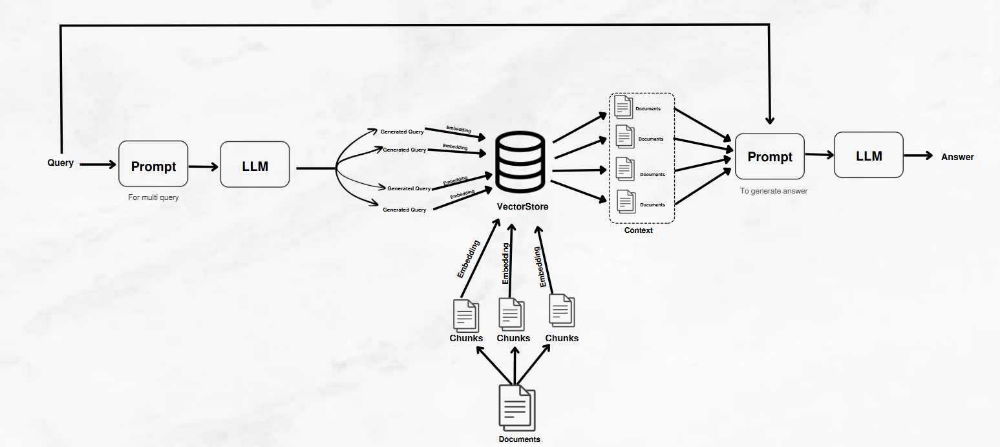

This repository contains a **Multi-Query RAG (Retrieval-Augmented Generation) chatbot** powered by **LangChain**, **ChromaDB**, and **OpenAI GPT-4o**. The application allows users to retrieve relevant information from documents using advanced AI-driven queries.

## Features

- Uses **Multi-Query RAG** to enhance retrieval accuracy.
- Supports document-based question answering.
- Implements **ChromaDB** for vector-based storage and retrieval.
- Utilizes **OpenAI's GPT-4o** for response generation.
- Simple UI built with **Streamlit**.

## Installation

1. Clone the repository:

   ```bash
   git clone https://github.com/yanal154/multi-query-rag.git
   cd your-repo
   ```

2. Create and activate a virtual environment:

   ```bash
   python -m venv venv
   source venv/bin/activate  # On Windows use `venv\Scripts\activate`
   ```

3. Install dependencies:

   ```bash
   pip install -r requirements.txt
   ```

4. Create a `.env` file in the root directory and add your **OpenAI API Key**:

   ```env
   OPENAI_API_KEY=your_openai_api_key
   ```

## Usage

1. **Prepare Your PDF File**:
   - Ensure your PDF file is accessible and note its file path.

2. **Load the PDF in `chatbot.py`**:
   - Open the `chatbot.py` file.
   - Locate the section where the PDF is loaded:
     ```python
     from langchain.document_loaders import PyPDFLoader

     # Replace 'your_pdf_file.pdf' with the path to your PDF file
     loader = PyPDFLoader("your_pdf_file.pdf")
     data = loader.load()
     ```
   - Replace `"your_pdf_file.pdf"` with the path to your desired PDF file.

3. **Run the Application**:
   - Execute the application as described in the [Running the Application](#running-the-application) section.

**Note**: Ensure that the PDF file is properly formatted and accessible to avoid any loading issues.

## Running the Application

To start the Streamlit UI, run:

```bash
streamlit run interface.py
```
## File Structure

- `chatbot.py`: Handles document loading, embedding, and retrieval logic.
- `interface.py`: Streamlit UI for user interaction.
- `requirements.txt`: Contains required dependencies.

## Multi-Query RAG Workflow



## Demo Video

[🎥 Watch the demo](rag.mp4)


